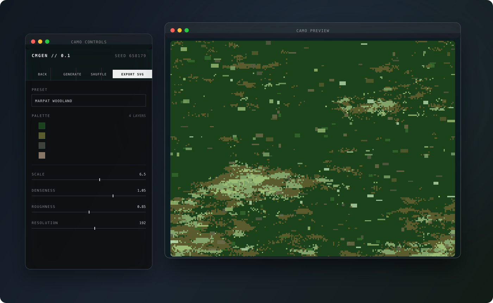

# DPM Tools

> **Work in progress** — experimental design tooling, not production-ready.

Toolkit for digital pattern and camouflage design workflows.



## Apps

| App | Description |
|-----|-------------|
| [dpm-tool-1](./dpm-tool-1/) | Digital camo pattern generator (Electron + React). Reference-driven presets, SVG export, modular floating windows. |

## Development

Each app is self-contained. From an app directory:

```bash
cd dpm-tool-1
npm install
npm run dev
```

Modular window layout (separate preview and controls panels):

```bash
MODULAR_WINDOWS=1 npm run dev
```

## Preview assets

- `docs/ui-preview.svg` — editable composite of the floating window layout
- `docs/sample-camo.svg` — exported pattern tile used in the preview

## Status

Experimental dev tooling — expect rough edges.
